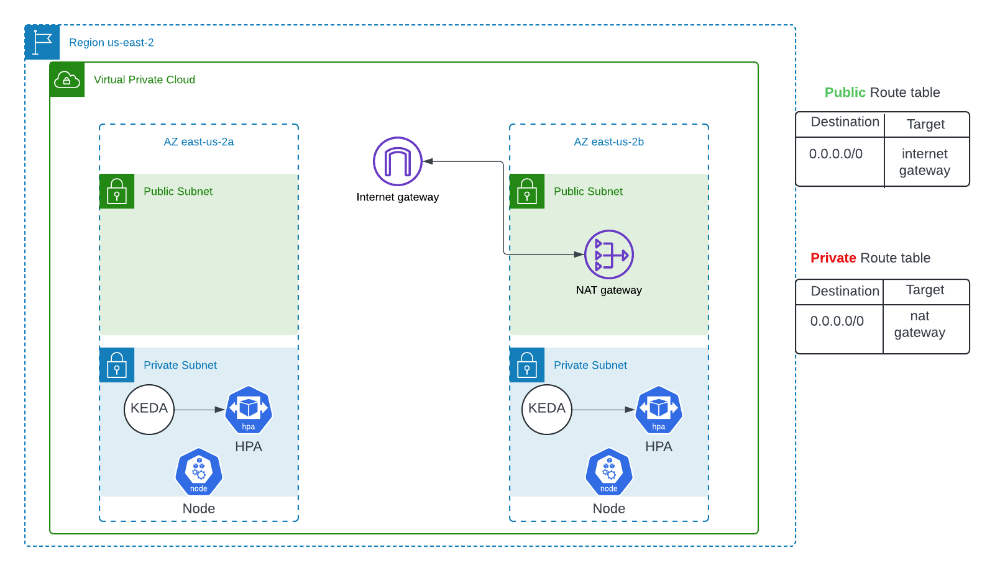

# AWS EKS Cluster with KEDA for HTTP Request-based Autoscaling

This project demonstrates the deployment of an AWS EKS (Elastic Kubernetes Service) cluster using Terraform. The deployment is fully automated with a single `terraform apply` command. After the infrastructure is set up, KEDA (Kubernetes Event-Driven Autoscaling) is used to scale the pods of an NGINX deployment based on HTTP requests rather than CPU usage.

## Why Use HTTP Requests Instead of CPU Usage?

The reason it's better to use HTTP requests is that they provide a more precise metric for measuring the performance and load of web applications. While CPU usage indicates how much processing power is being used, it doesn't necessarily reflect how efficiently your application is handling incoming requests. Monitoring HTTP requests allows you to gauge the actual workload your application is experiencing and how well it is responding to user interactions.

## Project Architecture



The architecture includes the following components:

- **VPC**: A Virtual Private Cloud in the `us-east-2` region with two Availability Zones (AZs: `us-east-2a` and `us-east-2b`).
- **Public Subnets**: Subnets with Internet Gateway access, where the Network Load Balancer (NLB) or Application Load Balancer (ALB) and NAT Gateway are deployed.
- **Private Subnets**: Subnets where EKS nodes are deployed, without direct access to the internet.
- **Route Tables**: Separate route tables for public and private subnets to manage routing within the VPC.
- **KEDA**: Kubernetes Event-Driven Autoscaling is configured to scale NGINX pods based on incoming HTTP requests.
- **HPA**: Horizontal Pod Autoscaler, configured to scale deployments based on metrics managed by KEDA.
- **NAT Gateway**: Allows private subnet instances to access the internet.

## Prerequisites

- **Terraform**: Install Terraform on your local machine. Follow the [official installation guide](https://learn.hashicorp.com/tutorials/terraform/install-cli).
- **AWS CLI**: Configure the AWS CLI with your credentials.
- **kubectl**: Install `kubectl` to manage your Kubernetes cluster.
- **Helm**: Install Helm for managing Kubernetes packages.

## Deployment Steps

### Step 1: Deploy NGINX Application

####  Create NGINX Deployment

Create a Kubernetes Deployment for the NGINX application, which will manage the NGINX pods. Save the following configuration as `nginx-deployment.yaml`:

```yaml
apiVersion: apps/v1
kind: Deployment
metadata:
  name: nginx-deployment
spec:
  replicas: 1
  selector:
    matchLabels:
      app: nginx
  template:
    metadata:
      labels:
        app: nginx
    spec:
      containers:
      - name: nginx
        image: nginx:latest
        ports:
        - containerPort: 80
---
apiVersion: v1
kind: Service
metadata:
  name: nginx-service
spec:
  selector:
    app: nginx
  ports:
  - protocol: TCP
    port: 80
    targetPort: 80
  type: LoadBalancer
```

### Step 2: Install KEDA

KEDA (Kubernetes Event-Driven Autoscaling) can be installed on your cluster using Helm.

#### 2.1 Add KEDA Helm Repository

Add the KEDA Helm repository and update: 
```
helm repo add kedacore https://kedacore.github.io/charts
helm repo update
```
#### 2.2 Install KEDA

Install KEDA in a dedicated namespace:

```
helm install keda kedacore/keda --namespace keda --create-namespace
```


### Step 3: Install Prometheus and Configure Monitoring
 
 #### 3.1 Add the Prometheus Helm Repository
Add the Helm repository for the kube-prometheus-stack:

```
helm repo add prometheus-community https://prometheus-community.github.io/helm-charts
helm repo update
```

#### 3.2 Install the kube-prometheus-stack

Install the Prometheus stack using Helm:

```
helm install prometheus prometheus-community/kube-prometheus-stack --namespace monitoring --create-namespace
```

This chart will deploy Prometheus, Alertmanager, and Grafana along with the necessary RBAC configurations.

#### 3.3 Create a ServiceMonitor for NGINX


Create a ServiceMonitor to scrape HTTP metrics from the NGINX service. Save the following configuration as nginx-monitor.yaml:

```yaml
apiVersion: monitoring.coreos.com/v1
kind: ServiceMonitor
metadata:
  name: nginx-monitor
  namespace: monitoring
spec:
  selector:
    matchLabels:
      app: nginx
  endpoints:
  - port: http
    path: /metrics
```

Apply the ServiceMonitor:

```
kubectl apply -f nginx-monitor.yaml
```

### Step 4: Configure KEDA for HTTP Request-based Autoscaling

#### 4.1 Create a KEDA ScaledObject

Create a KEDA ScaledObject to scale NGINX pods based on HTTP request metrics. Save the following configuration as nginx-scaledobject.yaml:

```yaml
apiVersion: keda.sh/v1alpha1
kind: ScaledObject
metadata:
  name: nginx-scaledobject
  namespace: default
spec:
  scaleTargetRef:
    name: nginx-deployment
  minReplicaCount: 1
  maxReplicaCount: 10
  cooldownPeriod: 30
  pollingInterval: 15
  triggers:
  - type: prometheus
    metadata:
      serverAddress: http://prometheus.monitoring.svc.cluster.local:9090
      metricName: nginx_http_requests_total
      query: sum(rate(nginx_http_requests_total[2m]))
      threshold: '10'
```

Apply the ScaledObject configuration:

```
kubectl apply -f nginx-scaledobject.yaml
```

### Step 5: Test the Autoscaling

Generate load to test if the HPA works. Start a load generator pod:

```
kubectl run -i --tty load-generator --image=busybox /bin/sh
```

#### Command Breakdown:

* kubectl run: This command is used to create and run a new Pod. It will create a single Pod with the specified attributes.

* -i: This flag stands for "interactive." It allows you to keep the stdin (standard input) open, which means you can provide input to the container after it starts.

* --tty: This flag allocates a TTY (teletypewriter) for the Pod, which makes the session interactive, as if you were using a terminal. It’s commonly used alongside the -i flag.

* load-generator: This is the name you’re giving to the Pod. In this case, the Pod is named "load-generator."


* --image=busybox: This specifies the container image that will be used for the Pod. In this case, it uses the busybox image, which is a minimalistic Linux-based image that includes basic UNIX utilities.

* /bin/sh: This is the command that will be executed in the container when the Pod starts. Here, /bin/sh launches a shell session inside the container.


#### Inside the pod, run a loop to send HTTP requests to your NGINX service:
```
while true; do wget -q -O- http://nginx-service.default.svc.cluster.local; done
```

This load should trigger the HPA, and you should observe the scaling of your NGINX pods based on the HTTP requests.


## Conclusion

This setup deploys an NGINX application on your Kubernetes cluster, exposes it as a service, and uses KEDA to scale the deployment based on HTTP request metrics. Make sure to monitor the setup and adjust the metrics threshold according to your specific needs.


## Clean Up

To remove all the resources created by Terraform and Kubernetes, run:

```
kubectl delete -f nginx-deployment.yaml
kubectl delete -f nginx-service.yaml
kubectl delete -f nginx-monitor.yaml
kubectl delete -f nginx-scaledobject.yaml
terrafrom destroy -auto-approve
```

This will delete all the AWS resources and clean up the environment.


## Additional Notes

* KEDA Configuration: The KEDA scaler is configured to monitor the number of HTTP requests hitting the NGINX service and scale the pods accordingly.

* Security: The architecture uses a private subnet for the EKS nodes, enhancing security by isolating them from direct internet access.

* Scalability: The architecture is designed to be highly scalable, with the ability to handle varying traffic loads through dynamic pod scaling.

## Contributing

If you would like to contribute to this project, feel free to submit a pull request or open an issue on the GitHub repository.